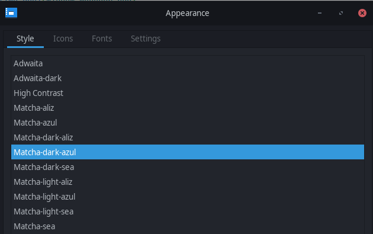
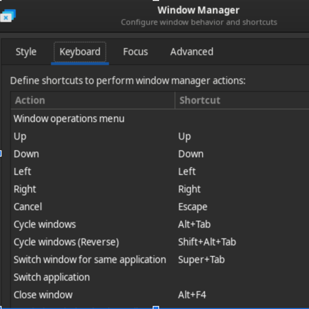
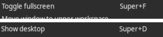
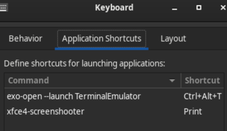
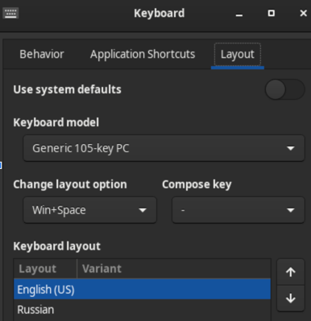
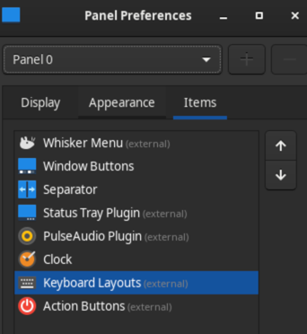

## Manjaro XFCE First setup

- software: update, reboot
- Disable beep
```bash
sudo su
echo "blacklist pcspkr" | tee /etc/modprobe.d/nobeep.conf
rmmod pcspkr
(https://wiki.archlinux.org/index.php/PC_speaker)
```
- chromium (setup no password, reopen previous, default browser)
- manjaro settings, kernel
- idea community
- sudo archlinux-java set java-11-openjdk  
- Mouse and Touchpad -> Select Device Touchpad, checkbox Reverse scroll direction
- Mouse and Touchpad-> Select Device Touchpad, and tab Touchpad. checkbox "Tab touchpad to click" true
- Appearance  

- Window Manager  
  
  
- Keyboard  
xfce4-screenshooter  [Print]
xfce4-popup-whiskermenu [Win Key]  
  
  
- Panel  

- Power Manager   
- Docker  
  https://manjaro.site/how-to-install-docker-on-manjaro-18-0/  
- download and run android_studio  
https://developer.android.com/studio/archive
```bash
archlinux-java status
sudo archlinux-java set java-8-openjdk
yes | ~/Android/Sdk/tools/bin/sdkmanager --licenses
sudo archlinux-java set java-11-openjdk
```
- [Optional] increase swapfile (https://www.linuxsecrets.com/manjaro-wiki/index.php%3Ftitle=Add_a_%252Fswapfile.html)
```bash
sudo swapoff /swapfile
sudo rm -rf /swapfile
sudo fallocate -l 35G /swapfile
sudo chmod 600 /swapfile
sudo mkswap /swapfile
sudo swapon /swapfile
# not need if change exists
#Add the following line to your /etc/fstab
#/swapfile none swap defaults 0 0
```
- add to bashrc  
```bash
source "/home/dim/Desktop/github/avdim/save/linux_install/_bashrc.sh"
```
